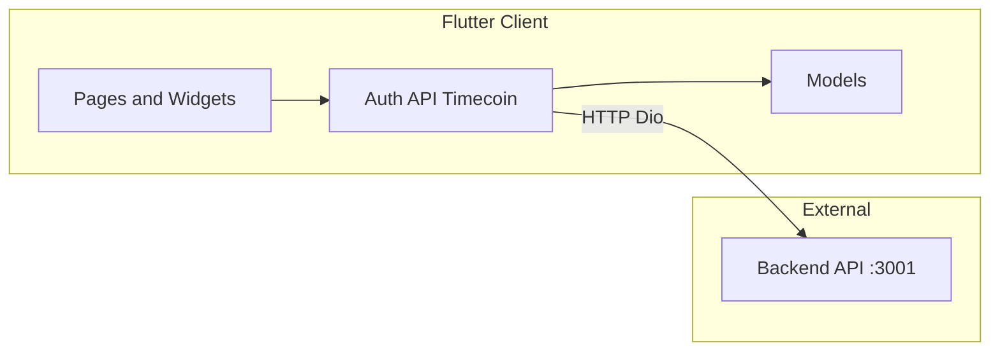
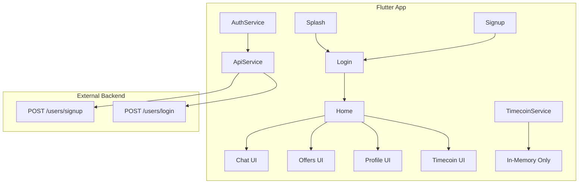

# SkillChain Trade-Your-Time — System Understanding Report

## 1. Repository Scope and Backend Assumptions

- **This repository is Flutter-only.** There is no backend source code in the workspace. The app expects an external backend at `http://100.31.106.71:3001` (see [lib/services/api_service.dart](lib/services/api_service.dart)).
- **Backend contract (inferred from client):**
  - `POST /users/signup` — body: fullName, email, password, bio, age, gender, location, phoneNumber, education, offeringSkills, learningSkills, pastExperience, portfolioLink, profilePic, resume; returns 201 with `user`.
  - `POST /users/login` — body: email, password; returns 200 with `user`, `accessToken`, `refreshToken`.
- Database schema, workflows, and AI logic are not visible in this repo; they are assumed to live in the external backend.

---

## 2. System Architecture

### 2.1 High-Level Architecture

- **Presentation:** Flutter UI in `lib/Pages/` and `lib/Widgets/`.
- **Business logic / data access:** `lib/services/` (AuthService, ApiService, TimecoinService).
- **Domain models:** `lib/models/` (User, Offer, Recommendation, TimecoinTransaction, ExchangeType).
- **Backend:** External HTTP API; no WebSockets, Firebase, or other real-time/push stack in the app.

### 2.2 Frontend Flow

- **Entry:** [lib/main.dart](lib/main.dart) runs `MyApp` → [lib/Pages/splash_screen.dart](lib/Pages/splash_screen.dart).
- **Splash:** Waits 3 seconds then **always** replaces with `LoginScreen`. It does **not** call `AuthService.initializeAuth()` or `isLoggedIn()`; sessions are not restored on cold start.
- **Auth:** Login/Signup use [lib/services/auth_service.dart](lib/services/auth_service.dart) (Dio + ApiService). On success, tokens and user data are stored via `FlutterSecureStorage` and `setAuthToken` is called on ApiService. Logout clears storage and clears token.
- **Post-login:** Login replaces with `HomeScreen`. Home is the hub with bottom nav: Home, Chat, Create Offer, Offers, Profile. Drawer repeats Home, My Offers, Timecoins, Messages, Notifications, Profile, Settings, Help, About, Logout.
- **Navigation:** Imperative only — `Navigator.push` / `pushReplacement` / `pushAndRemoveUntil`. No named routes or go_router; no deep linking.

### 2.3 Backend and Data Flow (from Flutter perspective)

- **API:** Single [lib/services/api_service.dart](lib/services/api_service.dart) instance (Dio), base URL constant, 30s timeouts, JSON headers. Token is set on the same Dio instance via `setAuthToken`. SSL bad-certificate callback is enabled (development-only comment).
- **Auth:** Only signup and login hit the backend. Token is applied to subsequent requests by the interceptor (header injection is prepared; the interceptor currently just calls `handler.next(options)`).
- **Other features:** Recommendations, offers, chat, timecoins, profile updates, and forgot-password are **not** wired to the backend from this codebase. They use in-memory or local-only state (see Feature mapping below).

### 2.4 Database and Schema (inferred from models only)

No DB exists in the repo. Client-side models imply the following **conceptual** entities and relations:

| Concept             | Source                                                           | Key fields (client view)                                                                                                                                                                                                                                                                                                           |
| ------------------- | ---------------------------------------------------------------- | ---------------------------------------------------------------------------------------------------------------------------------------------------------------------------------------------------------------------------------------------------------------------------------------------------------------------------------- | ---------------- |
| User                | [lib/models/user.dart](lib/models/user.dart)                     | id, fullName, email, password, age, gender, location, phoneNumber, portfolioLink, verified, bio, profilePic, education, offeringSkills, pastExperience, resume, timeCoins, subscriptionPackage, ratings, reviews, status, earnedCertificates, myOffers, legacy: username, posts, donations, connections, linkedin, github, twitter |
| Offer               | [lib/models/myoffer.dart](lib/models/myoffer.dart)               | id, userId, userName, userProfilePhoto, title, description, expiryDate, timeline, exchangeType, coverImage, skillsOffering, rewardTimeCoins, skillsNeeded, status, matchPercentage, offerDetails                                                                                                                                   |
| Recommendation      | [lib/models/recommendation.dart](lib/models/recommendation.dart) | id, name, profileImage, isVerified, rating, status, matchPercentage, isTopRated, offers, needs, exchangeType, timecoinCost                                                                                                                                                                                                         |
| TimecoinTransaction | [lib/models/timecoin.dart](lib/models/timecoin.dart)             | id, type, amount, description, timestamp, relatedUserId                                                                                                                                                                                                                                                                            |
| ExchangeType        | [lib/models/exchange_type.dart](lib/models/exchange_type.dart)   | skillExchange                                                                                                                                                                                                                                                                                                                      | timecoinExchange |

Relationships implied: User has many Offers; Recommendations are a view over users/offers with match info; TimecoinTransaction can reference a related user. Actual schema and persistence live on the backend.

---

## 3. Authentication and Authorization

- **Implemented:** Email/password signup and login via backend; JWT-style `accessToken` and `refreshToken` stored in `FlutterSecureStorage`; token attached to Dio (via `setAuthToken`). Logout clears storage and token.
- **Gaps:** No refresh-token flow (no 401 handling or automatic refresh). No call to `initializeAuth()` on app start, so no session restore. `getStoredUserData()` always returns `null` (user data is not parsed from storage). Forgot password is UI-only (simulated delay, no API). Social login buttons (Google/Facebook) are non-functional. No role-based or permission checks in the app.

---

## 4. Business Logic (in-app)

- **Timecoins:** [lib/services/timecoin_service.dart](lib/services/timecoin_service.dart) — singleton, in-memory: default balance 10, earn/spend/purchase with transaction list; no API, no persistence across restarts.
- **Offers / Recommendations:** Hardcoded lists in [lib/Pages/home_page.dart](lib/Pages/home_page.dart) and [lib/Pages/my_offers.dart](lib/Pages/my_offers.dart). Create-offer form in Home does not call API; it shows a success SnackBar only. Accept/Decline and timecoin earn/spend in My Offers use `TimecoinService` only.
- **Profile:** Current user on Home and drawer is a hardcoded `UserModel` ([lib/Pages/home_page.dart](lib/Pages/home_page.dart)). Edit profile updates local state and pops; no API call to update user.
- **Chat:** Inbox and thread data are local lists; send message only appends locally with simulated status updates. No backend or WebSocket.

---

## 5. AI-Related Components

- **None in this repository.** No automatic skill tagging, no intelligent matching, no recommendation engine in the Flutter app. Recommendations and match percentages are static sample data. Any AI would have to live in the external backend and be consumed by APIs not yet integrated.

---

## 6. Real-Time Communication

- **None.** Chat is local-only; no WebSockets, Socket.io, or Firebase. Video/voice buttons in [lib/Pages/chat_page.dart](lib/Pages/chat_page.dart) have no handlers. No presence (online/offline is static in sample data), no push notifications, no server-sent events.

---

## 7. Subscription and Payment Logic

- **Subscription:** `UserModel.subscriptionPackage` and verified badge exist in the model and UI; no subscription API or store integration. Premium/verified are display-only (sample data).
- **Payments:** Timecoin “Buy Timecoins” in [lib/Pages/timecoin_screen.dart](lib/Pages/timecoin_screen.dart) uses packages (e.g. 50 coins / $4.99). Tapping a package calls `TimecoinService.purchaseTimecoins()` only — in-memory balance update, no Stripe/RevenueCat/app store. No real payment or receipt validation.

---

## 8. Feature Mapping vs Product Vision

| Product vision                                             | Implemented                                                     | Partially implemented                                             | Missing                                         |
| ---------------------------------------------------------- | --------------------------------------------------------------- | ----------------------------------------------------------------- | ----------------------------------------------- |
| Build professional profiles                                | Yes (signup fields, profile/edit UI)                            | Profile and edit are local-only; no API load/save of current user | Backend sync for profile, photo upload          |
| Showcase skills offered and needed                         | Yes (signup: offering/learning; profile: offering; offer cards) | All offer/recommendation data is mock                             | API-driven offers and skills                    |
| AI recommendations / auto skill tagging                    | No                                                              | —                                                                 | Backend AI + APIs and integration               |
| Time-coin system when no skills to offer                   | Yes (balance, earn/spend/purchase UI)                           | Timecoins are in-memory only                                      | Backend ledger, persistence, sync               |
| Real-time chat                                             | UI only                                                         | Chat UI and bubbles                                               | WebSocket/backend chat, presence                |
| Video calls and session scheduling (calendar)              | No                                                              | Placeholder buttons (video/phone)                                 | WebRTC/video, calendar, scheduling              |
| Track learning progress                                    | No                                                              | —                                                                 | Progress model and UI                           |
| Online certifications                                      | No                                                              | Model has earnedCertificates                                      | Issuing and display of certificates             |
| Analytical dashboards                                      | No                                                              | —                                                                 | Dashboards and analytics APIs                   |
| Intelligent reminders and notifications                    | No                                                              | Notification icon and drawer badge                                | Push, reminders, backend triggers               |
| Feedback, ratings, fake listing reporting                  | No                                                              | UserModel has ratings/reviews                                     | Reviews API, reporting flow, trust              |
| Freemium: core free, premium (badges, mentoring, priority) | No                                                              | subscriptionPackage and verified in model/UI                      | Subscription and payment backend, store, gating |

---

## 9. Design Patterns and Conventions

- **State:** Local only — `StatefulWidget` + `setState`; no Provider, Riverpod, Bloc, or other global state.
- **Services:** Direct instantiation (`AuthService()`, `ApiService()`) or singleton (`TimecoinService.instance`). No DI.
- **API:** Single Dio instance in ApiService; auth token set on that instance. No repository layer; AuthService calls ApiService methods directly.
- **Navigation:** Material `Navigator` only; no declarative routing.
- **Naming:** `Pages/` (capital P), `Widgets/` (capital W); services and models lowercase. Mix of `Screen` and `Page` suffixes.
- **Linting:** `flutter_lints` in [analysis_options.yaml](analysis_options.yaml); no custom rule changes.

---

## 10. Architectural Risks and Technical Debt

- **Session not restored:** Splash never calls `initializeAuth()` or `isLoggedIn()`, so every launch goes to login. Tokens in storage are underused.
- **No refresh token handling:** 401s are not handled; token expiry will break all authenticated requests.
- **Backend coupling:** Base URL is a constant; no env/flavors. SSL bypass is dangerous if shipped to production.
- **Timecoins not persisted:** Balance and history reset on restart; no API and no local DB.
- **Mixed data sources:** Some flows (auth) use API; others (home, offers, chat, profile) use hardcoded data. Inconsistent pattern for loading and error states.
- **Large widgets:** [lib/Pages/home_page.dart](lib/Pages/home_page.dart) is very large (e.g. drawer, recommendation card, settings); refactor into smaller widgets or feature modules would help.
- **Duplicate “Settings”:** Home defines a minimal `SettingsScreen` in the same file; drawer opens it. No dedicated settings module.
- **Logout inconsistency:** Profile tab uses `ProfileActionButtons` (logout → login); drawer also has Logout. Both clear UI stack but AuthService.logout() is not called from profile logout (only from drawer). Verify both paths call logout.
- **No error boundary or global error handler:** API and service errors are handled locally; no centralized reporting or retry.
- **User model stores password:** `UserModel` has a `password` field; if ever filled from API, that is a security concern. Backend should not return password.

---

## 11. Summary Diagram (Conceptual)

- **Implemented end-to-end:** Signup, Login (and token storage), Logout (drawer path). UI for profile, offers, recommendations, chat, timecoins, forgot password (no API).
- **Partial:** Profile/edit and timecoin logic exist in UI and local service but are not backed by API or persistence.
- **Missing for vision:** AI recommendations, real-time chat/video/calendar, learning progress, certifications, dashboards, notifications, feedback/reporting, freemium/subscriptions, and real payments.

No code changes were made; this is analysis and documentation only.
